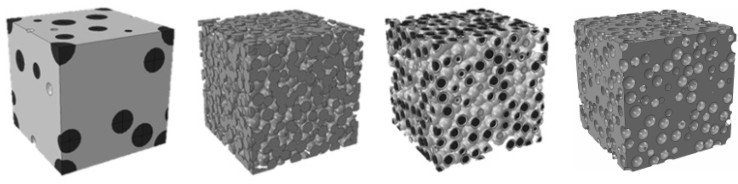
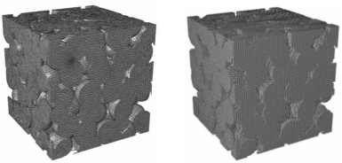

## Mote3D

UPDATE: Interface for geometry export to Ansys&#8482; DesignModeler available, please inquire for details.

Mote3D is an adaptable open-source software toolbox for the generation of random particulate 
microstructure models with periodic boundaries. Mote3D can be used to generate models 
that represent the microstructure of various inhomogeneous engineering materials such 
as particle-reinforced composites, partially sintered ceramics, powders, open-cell foams or 
concrete aggregates as well as of certain biomaterials or scaffolds. These models can be 
employed, for example, to analyse the relation between microstructure and overall mechanical, 
electrical or thermal properties by virtual material testing.

The Mote3D toolbox works by randomly positioning spherical particles with user-defined 
minimum inter-particle distance in a cubical computational domain. The generated 
microstructure models can be exported in different formats, either as lists of particle 
centre coordinates and radii or as input scripts for generating solid geometric models 
or regular hexahedral meshes (*voxel meshes*) in the commercial finite-element software
Abaqus&#8482; or similar preprocessors.

Mote3D requires [GNU Octave](http://www.gnu.org/software/octave/download.html). Additional
information on how to set up and run Mote3D can be found in the [Mote3D User Guide](docs/Mote3D%20User%20Guide.pdf). 
Further details on the implementation and some case studies are outlined in [this paper](https://doi.org/10.1088/1361-651X/aa629a).

Mote3D is licensed under the [GNU General Public License](LICENSE.txt).

<form id="ctcfrm" method="POST">
  <input name="email" type="email" placeholder="Your email">
  <textarea name="message" placeholder="Your message">Your message</textarea>
  <button type="submit"></button>
  <input type="hidden" name="_subject" value="MOTE3D" />
  <input type="text" name="_gotcha" style="display:none" />
</form>
